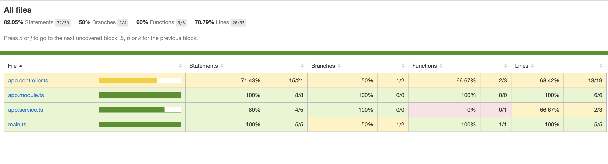
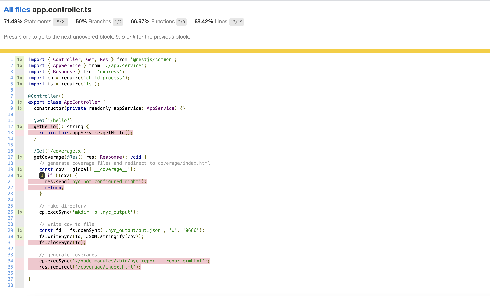

# NestJS 代码覆盖率生成

## 原理介绍

1. nyc 可以理解为是一个编译器，它的作用是对源代码进行插桩, 插入的代码会对全局对象 ```__coverage__``` 进行修改，这个全局对象会包含所有代码执行的信息，因此我们可以通过读取 ```__coverage__``` 即时生成测试覆盖率报告

2. nyc 提供了从 ```__coverage__``` 对象转成覆盖率报告的 api，我们可以在某个接口调用时调用 nyc 的这个 api, 从 ```__coverage__``` 对象生成 html 文件

## 报告效果图





## 配置 nyc 

1. 添加依赖

```sh
npm i -D nyc ts-node source-map-support @istanbuljs/nyc-config-typescript
npm i @nestjs/serve-static
```


2. 配置启动参数

在 package.json 的脚本中添加一项 cov

```json
{
  "scripts": {
    "cov": "rm -rf dist && nyc npm run start"
  }
}
```

3. 配置静态文件夹

nyc 编译输出的 html 文件会放置在进程工作目录下的 coverage 文件夹下，为了能在浏览器中访问 coverage 下的内容，需要在 app.module.ts 中配置静态资源目录

```typescript
import { Module } from '@nestjs/common';
import { AppController } from './app.controller';
import { AppService } from './app.service';
import { ServeStaticModule } from '@nestjs/serve-static';
import { join } from 'path';

@Module({
  imports: [
    ServeStaticModule.forRoot({
      // 这个相对路径表示的是进程的工作目录下的 converage
      rootPath: 'coverage',
      // 路径前缀是 /coverage
      serveRoot: '/coverage',
    }),
  ],
  controllers: [AppController],
  providers: [AppService],
})
export class AppModule {}
```

4. 配置触发器

触发器的思路:当访问 GET /coverage.x 时，把全局变量 ```__coverage__``` 写入到文件 ```.nyc_output/out.json``` 中，然后调用 shell 命令 ```nyc report --reporter=html``` 生成报告，最后重定向到生成的报告页面

```ts
import { Controller, Get, Res } from '@nestjs/common';
import { AppService } from './app.service';
import { Response } from 'express';
import cp = require('child_process');
import fs = require('fs');

@Controller()
export class AppController {
  constructor(private readonly appService: AppService) {}

  @Get('/hello')
  getHello(): string {
    return this.appService.getHello();
  }

  @Get('/coverage.x')
  getCoverage(@Res() res: Response): void {
    // generate coverage files and redirect to coverage/index.html
    const cov = global['__coverage__'];
    if (!cov) {
      res.send('nyc not configured right');
      return;
    }

    // make directory
    cp.execSync('mkdir -p .nyc_output');

    // write cov to file
    const fd = fs.openSync('.nyc_output/out.json', 'w', '0666');
    fs.writeSync(fd, JSON.stringify(cov));
    fs.closeSync(fd);

    // generate coverages
    cp.execSync('./node_modules/.bin/nyc report --reporter=html');
    res.redirect('/coverage/index.html');
  }
}
```

## 生成实时覆盖率报告

1. 通过 nyc 代理启动 nestjs 

```sh
npm run cov
```

2. 在浏览器访问 http://localhost:3000/coverage.x


